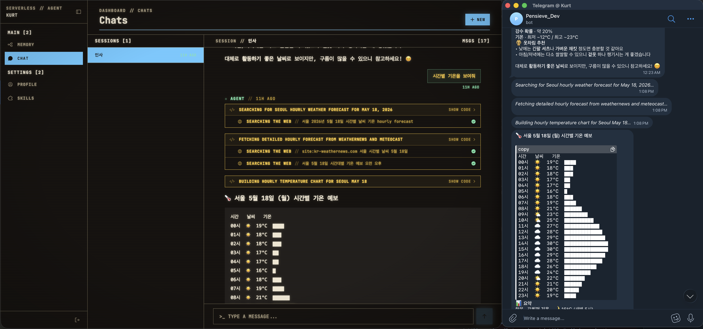

# Serverless Agent

> English version: **[README.md](./README.md)**

**AWS Summit Korea — DEV308** 세션 *맥 미니 없이도 서버리스로 만드는 AI Cloud Agent* 데모입니다. 발표자: 이상현 (Mirror).

AWS의 serverless 컴포넌트(Lambda, DynamoDB, S3, IoT Core, CloudFront)만으로 동작하는 cloud agent 구현입니다. 채팅 UI, LLM loop + tool calling 런타임, 영구 메모리, 실시간 브라우저 업데이트가 포함되어 있습니다. AWS 인프라는 idle 상태에서는 사실상 청구되지 않습니다 (LLM API 비용은 별도).



*동일한 채팅 세션이 웹 UI(왼쪽)와 Telegram 봇(오른쪽)에 동시에 표시되는 모습. tool-call 진행 상황이 양쪽으로 실시간 스트리밍됩니다.*

---

## 아키텍처

```
Browser
  │
  ▼
CloudFront (기본 *.cloudfront.net 호스트)
  │    ├─ S3                 ← React SPA 정적 자산 + index.html SPA fallback
  │    └─ Lambda@Edge        ← origin-request에서 /api/* → backend Function URL 재작성
  │           │                (URL은 SSM에서 읽고 60초 캐시)
  │           ▼
  │       Backend Lambda (Hono, Node.js 24)
  │           │
  │  ┌────────┼─────────────┬──────────────────┐
  │  ▼        ▼             ▼                  ▼
  │ DynamoDB  S3            Agent Runtime      AWS IoT Core
  │ (7개 테이블)(에이전트 파일)(LLM loop +       (사용자/세션 단위
  │  │         │             샌드박스 + 스킬)    MQTT 토픽)
  │  │         │             │                  │
  │  └─────────┴─────────────┴──────────────────┘
  │                          │
  └── 실시간 DB row 델타 ◄────┘
      (브라우저는 WSS로 구독)
```

**Edge — CloudFront + Lambda@Edge.** CloudFront 배포 1개. 정적 자산은 S3에서 직접 내려옵니다. `/api/*` 요청은 origin-request 단에서 Lambda@Edge 함수(`packages/edge/src/origin-request/`)가 SSM Parameter Store에서 backend Function URL을 읽어 재작성합니다. SSM 조회는 Lambda 인스턴스 메모리에 60초간 캐시됩니다. 기본 `*.cloudfront.net` 호스트를 사용 (Route53, ACM 없음).

**Backend — Lambda + Hono.** `packages/backend/src/lambda-api/`는 Hono 앱이며, Function URL을 가진 단일 Lambda로 배포됩니다. REST 라우트는 `/api/auth/*`, `/api/chat-sessions/*` 등.

**Agent runtime — Lambda 안의 LLM loop.** `packages/backend/src/agent-runtime/`. LLM에게는 도구가 단 하나, `executeCode`만 노출됩니다. 이 도구는 샌드박스 안에서 TypeScript를 실행하고, 샌드박스에는 `skill-runtimes/` 아래 스킬들(`memory`, `web-search`, `google-calendar`)에 대한 타입이 붙은 바인딩이 있습니다. 모든 스킬 호출은 Proxy를 거쳐 trace 이벤트를 발행하고, UI는 그 이벤트로 tool-call 카드를 그립니다.

**Storage — DynamoDB.** 테이블 7개, `packages/backend/scripts/lib/backend-stack.ts`에 선언됨: `users`, `sessions`, `profiles`, `memories`, `chat-sessions`, `chat-messages`, `user-skills`. On-demand pricing, PITR 활성화. `sessions` 테이블은 `expires_at_epoch` 컬럼에 DynamoDB TTL을 걸어둠. 리포지토리는 `src/<domain>/*-repository.ts` 아래에서 `src/lib/ddb.ts`의 DocumentClient 싱글톤을 거칩니다. 테이블 이름은 CDK가 환경 변수로 주입.

**Files — S3.** 에이전트가 만든 산출물(transcript, 다운로드 등)은 SPA와 별도의 버킷에 저장. 읽을 때 pre-signed URL 발급.

**Realtime — AWS IoT Core.** 관리형 MQTT 브로커. 브라우저는 SigV4 서명된 URL로 WSS를 통해 접속합니다. Lambda 에이전트 loop는 사용자별 MQTT 토픽에 이벤트(tool-call 시작/종료, 메시지 청크, DDB row 업데이트)를 발행하고, React 앱은 `/api/realtime/credentials`에서 받은 임시 자격 증명으로 그 토픽을 구독합니다. 이벤트 모양은 `src/lib/realtime-events.ts`에 정의되어 프론트엔드와 공유.

**Auth — scrypt + 쿠키 세션.** `POST /api/auth/sign-{in,up,out}`. 비밀번호 해싱은 scrypt. 쿠키는 `sa_session` (HTTP-only, SameSite=Lax, Secure). 세션 row는 DDB에 TTL과 함께 저장. 자세한 건 `packages/backend/src/auth/`.

---

## 요청 한 건의 흐름 (채팅 메시지 1개)

1. 첫 페이지 로드: Browser → CloudFront → S3 (정적).
2. 메시지 전송: Browser가 `/api/chat-sessions/:id/messages`로 POST → CloudFront → Lambda@Edge가 backend Function URL로 재작성 → backend Lambda.
3. backend Lambda가 사용자 메시지를 DDB에 쓰고 200을 응답한 뒤, 해당 세션의 에이전트 실행을 비동기로 시작.
4. Agent runtime이 DDB에서 컨텍스트(최근 메시지, 프로필, 메모리)를 읽고, `executeCode`를 유일한 도구로 Anthropic을 호출.
5. LLM이 작성한 TypeScript를 TypeScript 컴파일러 API로 타입체크. 타입 에러는 LLM에 반환되어 재시도.
6. 타입체크가 통과한 코드를 샌드박스에서 실행. 샌드박스 안에서 `await webSearch.query(...)`는 Tavily를, `await memory.upsert(...)`는 DDB를 호출. 각 호출은 trace되어 MQTT 이벤트로 발행되며, 메시지와 tool-call state도 DDB에 쓰이는 즉시 MQTT로 반영.
7. 브라우저는 MQTT 이벤트를 받아 메시지 row와 tool-call 카드를 리렌더링. polling 없음.
8. 에이전트가 최종 assistant 메시지를 DDB에 쓰고 마지막 이벤트를 발행. Lambda는 idle 상태로 복귀.

요청 1건당 쓰이는 인프라: Lambda 함수 1개, DDB 테이블 7개, S3 버킷 1개, 사용자당 IoT 토픽 1개, CloudFront 배포 1개.

---

## 저장소 구조

```
packages/
  backend/
    scripts/lib/backend-stack.ts     ← CDK: Lambda, S3, DynamoDB 테이블
    src/
      auth/                          ← scrypt + 쿠키 세션
      users/                         ← DynamoDB 위의 users-repository
      profiles/                      ← DynamoDB 위의 profiles-repository
      memories/                      ← DynamoDB 위의 memories-repository
      chat-sessions/                 ← DynamoDB 위의 chat sessions + messages
      skills/                        ← OAuth 스킬 정의 (Google 등) on DynamoDB
      channels/                      ← Telegram 채널 dispatcher
      agent-runtime/                 ← LLM loop, 샌드박스, 스킬 런타임
        skill-runtimes/              ← 스킬들 (memory, web-search, google-calendar)
      lambda-api/                    ← Hono 라우트
      lib/
        ddb.ts                       ← DocumentClient 싱글톤 + 테이블명 env 조회
        realtime-events.ts           ← MQTT 이벤트 모양 (프론트엔드와 공유)
      types/database.ts              ← TS row 타입
  frontend/                          ← Vite + React + TanStack Router
  edge/
    scripts/lib/edge-stack.ts        ← CDK: CloudFront + Lambda@Edge + S3
    src/origin-request/              ← /api/* → backend Function URL 라우팅
  shared/                            ← config 로더, SSM 네이밍
scripts/
  dev.ts                             ← 개발 서버 start/stop
  setup.ts                           ← 인터랙티브 tss.json bootstrapper
```

---

## 실행 방법

### 사전 준비

- Node 24 (`.nvmrc` 참고)
- AWS 자격 증명 (DynamoDB, IoT, S3, Lambda, CloudFront, SSM)
- API 키: Anthropic (LLM), Tavily (웹 검색)

### 1회성 프로젝트 설정

```bash
cp .env.sample .env
cp packages/backend/.env.sample packages/backend/.env.development
cp packages/frontend/.env.sample packages/frontend/.env.development
# 각 파일에 키를 채워 넣으세요.
```

`tss.json`을 열어 `project`와 `repo`를 본인 값으로 바꾸세요.

### 로컬 개발

모든 스크립트는 shebang으로 실행 가능합니다 — 직접 실행하세요.

```bash
npm install
./scripts/dev.ts start        # backend + frontend + edge proxy를 백그라운드에서 기동
./scripts/dev.ts status       # 상태 + edge proxy URL 출력
./scripts/dev.ts stop
```

앱은 `start`가 출력한 edge proxy URL로 접근하세요 — 이게 프로덕션의 CloudFront → Lambda@Edge → backend 흐름과 동일합니다.

dev backend는 실제 DynamoDB 테이블(이름은 `.env.development`의 `TABLE_*`에서 옴)을 두드립니다. 테이블 이름에 `-dev` 접미사를 붙이거나, DynamoDB Local을 연결하세요.

### CI parity (push 전에 실행)

```bash
./packages/backend/scripts/build-types.ts \
  && ./packages/backend/scripts/lint.ts \
  && npm test -w backend

./packages/backend/scripts/build-types.ts \
  && ./packages/frontend/scripts/build-types.ts \
  && ./packages/frontend/scripts/lint.ts \
  && npm test -w frontend
```

`tsc`를 직접 실행하지 마세요 — 항상 `build-types.ts` 스크립트를 거치세요. 이유는 `CLAUDE.md` 참고.

### 배포

```bash
./packages/edge/scripts/deploy.ts deploy              # CloudFront + Lambda@Edge + S3
./packages/backend/scripts/deploy.ts --env=production # backend Lambda + DDB 테이블
./packages/frontend/scripts/deploy.ts --env=production
```

첫 배포 때 순서가 중요합니다: edge가 frontend가 배포될 S3 버킷을 만들고, backend는 Function URL을 SSM에 써두면 그 값을 edge의 Lambda@Edge 함수가 나중에 읽습니다. Lambda@Edge는 `us-east-1`에서만 배포 가능; backend는 어느 리전이든 가능합니다.

---

## 로컬에서 외부 연동 테스트하기

아래에서 `<edge>`는 `./scripts/dev.ts start`가 출력한 edge proxy URL (기본 `http://localhost:3000`, `tss.json`에서 변경 가능).

### 인증된 사용자로 API 호출하기

dev (`NODE_ENV=development`)에서는 `X-Dev-Role: user` 헤더를 넘기면 쿠키 세션을 건너뛰고 dev 사용자로 인증됩니다.

```bash
curl -H "X-Dev-Role: user" <edge>/api/chat-sessions
```

이 헤더는 production 빌드에서는 거부됩니다.

### Google Calendar (OAuth)

콜백 URL은 들어오는 요청 host에서 만들어지므로, 로컬 개발에서는 `<edge>/api/skills/oauth/callback`을 OAuth 클라이언트의 redirect URI로 등록해두면 됩니다.

1. **OAuth 클라이언트 생성** — Google Cloud Console → APIs & Services → Credentials → *Create Credentials* → *OAuth client ID* → application type **Web**.
   - Authorized JavaScript origin: `<edge>` (예: `http://localhost:3000`)
   - Authorized redirect URI: `<edge>/api/skills/oauth/callback`
2. **Google Calendar API 활성화** — 같은 프로젝트에서 APIs & Services → Library.
3. **Client ID / Secret 추가** — `packages/backend/.env.development`:
   ```bash
   GOOGLE_CLIENT_ID="…apps.googleusercontent.com"
   GOOGLE_CLIENT_SECRET="…"
   ```
4. dev 재시작: `./scripts/dev.ts stop && ./scripts/dev.ts start`.
5. UI에서: Settings → Skills → *Connect Google Calendar*. OAuth round-trip이 access + refresh 토큰을 `user-skills` DDB row에 저장합니다. 만료된 토큰은 에이전트 런타임이 갱신합니다.

토큰은 DynamoDB에만 저장되며, env 파일이나 git에는 들어가지 않습니다.

### Telegram (실제 BotFather 봇)

Telegram은 `localhost`로 webhook을 보내지 않기 때문에 public HTTPS URL이 필요합니다. install 라우트는 dev에서 `setWebhook`을 건너뛰지만, `EDGE_PUBLIC_URL`이 설정되어 있으면 호출합니다. `cloudflared` quick tunnel로 실제 봇과의 round-trip이 가능합니다.

```bash
# 1. edge proxy로 향하는 터널을 엽니다. public URL이 출력됩니다.
#    (cloudflared는 Homebrew로 설치. `--url`에는 로그인 불필요.)
cloudflared tunnel --url <edge> --no-autoupdate
#    → https://<random-words>.trycloudflare.com

# 2. 터널 URL을 packages/backend/.env.development에 추가:
#    EDGE_PUBLIC_URL="https://<random-words>.trycloudflare.com"

# 3. backend가 startup 때 env를 읽으므로 dev 재시작:
./scripts/dev.ts stop && ./scripts/dev.ts start

# 4. 터널 연결 확인:
curl https://<random-words>.trycloudflare.com/api/health

# 5. @BotFather에서 봇 생성 (/newbot → 이름 → @handle → 토큰).

# 6. UI에서: Settings → Skills → Connect Telegram → 토큰 붙여넣기.
#    install 라우트가 터널 URL로 setWebhook을 등록합니다.

# 7. 봇에게 DM을 보내세요. 사이드바에 채팅이 생기고, 에이전트의 답변이 Telegram으로 돌아옵니다.

# 8. 끝났으면 UI에서 disconnect — deleteWebhook을 호출하고 row를 정리합니다.
```

참고:
- `cloudflared --url` 터널은 임시(ephemeral)입니다. `cloudflared`를 재시작하면 새 URL이 발급되므로 `EDGE_PUBLIC_URL`을 갱신하고 dev도 재시작해야 합니다. 안 그러면 Telegram이 죽은 터널을 가리키게 됩니다.
- 봇 토큰은 `user-skills` DDB row 안에만 저장되며, env 파일에는 들어가지 않습니다.

### E2E 브라우저 테스트

dev 서버와 별개로 동작하는 headless Chrome 하니스가 CDP로 SPA를 조작합니다.

```bash
./scripts/e2e.ts start                  # headless Chrome 기동 (CDP endpoint는 .e2e-status.json)
./scripts/e2e.ts login                  # dev 사용자로 인증
./scripts/e2e.ts navigate /dashboard
./scripts/e2e.ts screenshot             # → .tmp/screenshot-<ts>.png
./scripts/e2e.ts run-js "document.title"
./scripts/e2e.ts click ".button"
./scripts/e2e.ts type "input" "text"
./scripts/e2e.ts wait ".loaded"
./scripts/e2e.ts page-text
./scripts/e2e.ts stop
```

Chrome 인스턴스는 명령 사이에 CDP로 유지됩니다.

---

## 시스템에 새 컴포넌트 추가하기

- **새 DynamoDB 테이블** — `packages/backend/scripts/lib/backend-stack.ts`에 선언, `allTables`와 `tableEnv`에 추가, `src/lib/ddb.ts`에 이름 getter 추가, `src/types/database.ts`에 row 타입 추가, 기존 리포지토리들 옆에 새 리포지토리 작성.
- **새 HTTP 라우트** — `src/lambda-api/routes/<name>.ts`에서 `routes`를 export, `src/lambda-api/routes/index.ts`로 spread. 인증이 필요하면 `c.get("requireUser")()` 사용.
- **새 에이전트 스킬** — `src/agent-runtime/skill-runtimes/<name>.ts`에 `defineSkillRuntime`으로 작성, `skill-runtimes/index.ts`와 `skills/builtins.ts`에 등록, 그리고 `./packages/backend/scripts/generate-declarations.ts` 실행. LLM은 생성된 `.d.ts`로 스킬 인터페이스를 보기 때문에, 타입체크만으로는 stale declaration을 잡지 못합니다.

프론트엔드는 `@backend/*` path alias로 백엔드 타입을 직접 import하므로, cross-package 타입 깨짐은 프론트엔드 타입체크에서만 드러납니다 — 양쪽 다 돌리세요.

---

## 상태

컴파일 통과. CI 두 잡 로컬에서 green. 위 아키텍처가 실제 코드와 일치. 발표 시점에 AWS에 end-to-end 배포는 아직 안 된 상태이며, 세션에서 배포 경로와 그 과정에서 만난 함정들(Lambda@Edge 리전 고정, cross-region SSM 조회, IoT Core SigV4)을 다룹니다.

---

## License

MIT (의도 — 저장소를 public으로 전환할 때 `LICENSE` 파일을 추가할 예정).
