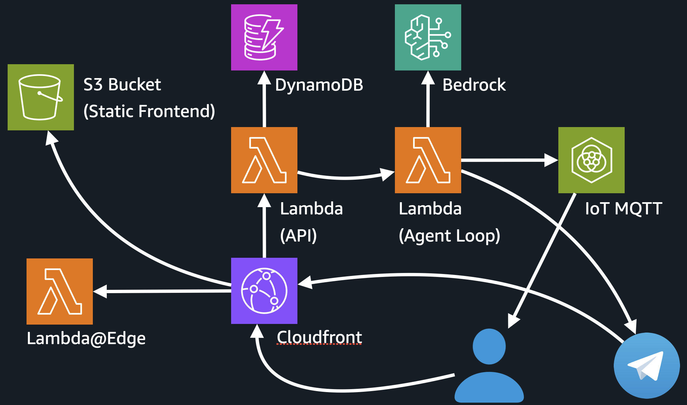

# Serverless Agent

> 한국어 버전: **[README.ko.md](./README.ko.md)**

Example repo for the **AWS Summit Korea — DEV308** session *맥 미니 없이도 서버리스로 만드는 AI Cloud Agent*. Speaker: 이상현 (Mirror).

A cloud agent implementation that runs on AWS serverless components only (Lambda, DynamoDB, S3, IoT Core, CloudFront). Includes a chat UI, an LLM loop with tool calling, persistent memory, and realtime browser updates. The AWS infrastructure is effectively unbilled while idle (LLM API costs are separate).


*Same chat session shown in the web UI (left) and mirrored to a Telegram bot (right). Tool-call progress streams live to both surfaces.*

---

## Architecture



**Edge — CloudFront + Lambda@Edge.** One CloudFront distribution. Static assets come from S3. `/api/*` requests trigger a Lambda@Edge function at origin-request (`packages/edge/src/origin-request/`) that reads the backend Function URL from SSM Parameter Store and rewrites the request. The SSM lookup is cached for 60s in the Lambda instance's memory. Uses the default `*.cloudfront.net` hostname (no Route53, no ACM).

**API Lambda — Hono.** `packages/backend/src/lambda-api/` is a Hono app deployed as the API Lambda behind a Function URL. REST routes live under `/api/auth/*`, `/api/chat-sessions/*`, etc. On chat-message routes it writes to DDB, async-invokes the Worker Lambda, and returns immediately so the HTTP request doesn't block on the LLM run.

**Worker Lambda — agent loop.** `packages/backend/src/worker/`. Async-invoked by the API for each turn. Runs the LLM loop, executes the sandboxed TypeScript, publishes progress events to MQTT, and writes outputs to DDB.

**Agent runtime — LLM loop in the Worker.** `packages/backend/src/agent-runtime/`. The LLM (Bedrock) is given one tool, `executeCode`, which runs TypeScript inside a sandbox. The sandbox exposes typed bindings to the skills under `skill-runtimes/` (`memory`, `web-search`, `google-calendar`). Every skill call goes through a Proxy that emits a trace event; the UI uses those events to render tool-call cards.

**Storage — DynamoDB.** Seven tables declared in `packages/backend/scripts/lib/backend-stack.ts`: `users`, `sessions`, `profiles`, `memories`, `chat-sessions`, `chat-messages`, `user-skills`. On-demand pricing, PITR on. The `sessions` table has DynamoDB TTL on `expires_at_epoch`. Repos under `src/<domain>/*-repository.ts` go through the DocumentClient singleton in `src/lib/ddb.ts`. Table names are injected as env vars by CDK.

**Files — S3.** Agent-generated artifacts (transcripts, downloads) live in a bucket separate from the SPA. Pre-signed URLs on read.

**Realtime — AWS IoT Core.** Managed MQTT broker reachable from the browser over WSS using a SigV4-signed URL. The Lambda agent loop publishes events (tool-call start/end, message chunks, DDB row updates) to a per-user MQTT topic; the React app subscribes with a temporary credential from `/api/realtime/credentials`. Event shapes live in `src/lib/realtime-events.ts` and are shared with the frontend.

**Auth — scrypt + cookie sessions.** `POST /api/auth/sign-{in,up,out}`. scrypt for password hashing. `sa_session` cookie: HTTP-only, SameSite=Lax, Secure. Session rows in DDB with TTL. See `packages/backend/src/auth/`.

---

## Request lifecycle (one chat message)

1. First page load: Browser → CloudFront → S3 (static).
2. Send message: Browser `POST /api/chat-sessions/:id/messages` → CloudFront → Lambda@Edge rewrites to the backend Function URL → backend Lambda.
3. API Lambda writes the user message to DDB, async-invokes the Worker Lambda for that session, and returns 200.
4. Worker Lambda reads context from DDB (recent messages, profile, memories) and calls Bedrock with `executeCode` as the only tool.
5. The LLM-written TypeScript is type-checked via the TypeScript compiler API. Type errors are surfaced back to the LLM for a retry.
6. The code runs in the sandbox. Inside, `await webSearch.query(...)` hits Tavily, `await memory.upsert(...)` writes to DDB. Each call is traced and published as an MQTT event; messages and tool-call state are written to DDB as they happen.
7. Browser receives the MQTT events and re-renders message rows and tool-call cards. No polling.
8. Worker writes the final assistant message to DDB, publishes a final event, and goes idle.

Per request, the infrastructure used is: 2 Lambda functions (API + Worker), 7 DDB tables, 1 S3 bucket, 1 IoT topic per user, 1 CloudFront distribution.

---

## Repo layout

```
packages/
  backend/
    scripts/lib/backend-stack.ts     ← CDK: Lambda, S3, DynamoDB tables
    src/
      auth/                          ← scrypt + cookie sessions
      users/                         ← users-repository on DynamoDB
      profiles/                      ← profiles-repository on DynamoDB
      memories/                      ← memories-repository on DynamoDB
      chat-sessions/                 ← chat sessions + messages on DynamoDB
      skills/                        ← OAuth skill definitions (Google, etc.) on DynamoDB
      channels/                      ← Telegram channel dispatcher
      agent-runtime/                 ← LLM loop, sandbox, skill runtime
        skill-runtimes/              ← skills (memory, web-search, google-calendar)
      lambda-api/                    ← API Lambda entry — Hono routes
      worker/                        ← Worker Lambda entry — agent loop, async-invoked
      lib/
        ddb.ts                       ← DocumentClient singleton + table-name env lookup
        realtime-events.ts           ← MQTT event shapes (shared with frontend)
      types/database.ts              ← TS row types
  frontend/                          ← Vite + React + TanStack Router
  edge/
    scripts/lib/edge-stack.ts        ← CDK: CloudFront + Lambda@Edge + S3
    src/origin-request/              ← routes /api/* → backend Function URL
  shared/                            ← config loader, SSM naming
scripts/
  dev.ts                             ← start/stop dev servers
  setup.ts                           ← interactive tss.json bootstrapper
```

---

## Running it

### Prerequisites

- Node 24 (see `.nvmrc`)
- AWS credentials (DynamoDB, IoT, S3, Lambda, CloudFront, SSM)
- LLM via AWS Bedrock (uses AWS credentials, no separate API key)
- Tavily API key for web search

### One-time project config

```bash
cp .env.sample .env
cp packages/backend/.env.sample packages/backend/.env.development
cp packages/frontend/.env.sample packages/frontend/.env.development
# Fill in the keys.
```

Edit `tss.json` and set `project` and `repo` to your values.

### Local dev

All scripts are executable — run them directly.

```bash
npm install
./scripts/dev.ts start        # backend + frontend + edge proxy in the background
./scripts/dev.ts status       # state + edge proxy URL
./scripts/dev.ts stop
```

Access the app through the edge proxy URL printed by `start` — that mirrors the production CloudFront → Lambda@Edge → backend flow.

The dev backend talks to real DynamoDB tables (named by `TABLE_*` in `.env.development`). Use a `-dev` suffix or wire in DynamoDB Local.

### CI parity (before pushing)

```bash
./packages/backend/scripts/build-types.ts \
  && ./packages/backend/scripts/lint.ts \
  && npm test -w backend

./packages/backend/scripts/build-types.ts \
  && ./packages/frontend/scripts/build-types.ts \
  && ./packages/frontend/scripts/lint.ts \
  && npm test -w frontend
```

Don't run `tsc` directly — go through the `build-types.ts` scripts. See `CLAUDE.md`.

### Deploy

```bash
./packages/edge/scripts/deploy.ts deploy              # CloudFront + Lambda@Edge + S3
./packages/backend/scripts/deploy.ts --env=production # backend Lambda + DDB tables
./packages/frontend/scripts/deploy.ts --env=production
```

Order matters on the first deploy: edge creates the S3 bucket the frontend deploys into, and the backend writes its Function URL into SSM where the Lambda@Edge function later reads it. Lambda@Edge is `us-east-1` only; the backend can live in any region.

---

## Testing integrations locally

Replace `<edge>` below with the edge proxy URL printed by `./scripts/dev.ts start` (default `http://localhost:3000`, configurable in `tss.json`).

### Calling the API as an authed user

In dev (`NODE_ENV=development`), pass `X-Dev-Role: user` to skip the cookie session and authenticate as the dev user.

```bash
curl -H "X-Dev-Role: user" <edge>/api/chat-sessions
```

The header is rejected in production builds.

### Google Calendar (OAuth)

The callback URL is derived from the request host, so for local dev register `<edge>/api/skills/oauth/callback` as the redirect URI on your OAuth client.

1. **Create an OAuth client** — Google Cloud Console → APIs & Services → Credentials → *Create Credentials* → *OAuth client ID* → application type **Web**.
   - Authorized JavaScript origin: `<edge>` (e.g. `http://localhost:3000`)
   - Authorized redirect URI: `<edge>/api/skills/oauth/callback`
2. **Enable the Google Calendar API** for the same project (APIs & Services → Library).
3. **Add the client ID/secret** to `packages/backend/.env.development`:
   ```bash
   GOOGLE_CLIENT_ID="…apps.googleusercontent.com"
   GOOGLE_CLIENT_SECRET="…"
   ```
4. Restart dev: `./scripts/dev.ts stop && ./scripts/dev.ts start`.
5. In the UI: Settings → Skills → *Connect Google Calendar*. The OAuth round-trip writes access + refresh tokens into the `user-skills` DDB row; the agent runtime refreshes expired tokens.

Tokens are stored only in DynamoDB, never in env files or git.

### Telegram (real BotFather bot)

Telegram doesn't deliver webhooks to `localhost`, so a public HTTPS URL is needed. The install route skips `setWebhook` in dev unless `EDGE_PUBLIC_URL` is set. A `cloudflared` quick tunnel works for the full round-trip against a real bot.

```bash
# 1. Open a tunnel to the edge proxy. Prints a public URL.
#    (cloudflared from Homebrew. No login needed for `--url`.)
cloudflared tunnel --url <edge> --no-autoupdate
#    → https://<random-words>.trycloudflare.com

# 2. Add the URL to packages/backend/.env.development:
#    EDGE_PUBLIC_URL="https://<random-words>.trycloudflare.com"

# 3. Restart dev so the backend reads it at startup:
./scripts/dev.ts stop && ./scripts/dev.ts start

# 4. Sanity check:
curl https://<random-words>.trycloudflare.com/api/health

# 5. Create a bot via @BotFather (/newbot → name → @handle → token).

# 6. UI → Settings → Skills → Connect Telegram → paste the token.
#    The install route calls setWebhook against the tunnel URL.

# 7. DM the bot. A chat appears in the sidebar; the agent's reply goes back to Telegram.

# 8. Disconnect from the UI when done — calls deleteWebhook and removes the row.
```

Notes:
- `cloudflared --url` tunnels are ephemeral. Restarting `cloudflared` gives a new URL — update `EDGE_PUBLIC_URL` and restart dev, otherwise Telegram is pointing at a dead tunnel.
- The bot token is stored in the `user-skills` DDB row only, not in env files.

### E2E browser testing

A headless-Chrome harness drives the SPA via CDP, separate from the dev server.

```bash
./scripts/e2e.ts start                  # start headless Chrome (CDP endpoint in .e2e-status.json)
./scripts/e2e.ts login                  # authenticate as the dev user
./scripts/e2e.ts navigate /dashboard
./scripts/e2e.ts screenshot             # → .tmp/screenshot-<ts>.png
./scripts/e2e.ts run-js "document.title"
./scripts/e2e.ts click ".button"
./scripts/e2e.ts type "input" "text"
./scripts/e2e.ts wait ".loaded"
./scripts/e2e.ts page-text
./scripts/e2e.ts stop
```

The Chrome instance persists across commands via CDP.

---

## Adding to the system

- **A new DynamoDB table** — declare it in `packages/backend/scripts/lib/backend-stack.ts`, add it to `allTables` and `tableEnv`, add a name getter in `src/lib/ddb.ts`, add the row type to `src/types/database.ts`, write a repo next to the existing ones.
- **A new HTTP route** — `src/lambda-api/routes/<name>.ts`, export `routes`, spread into `src/lambda-api/routes/index.ts`. Use `c.get("requireUser")()` for auth.
- **A new agent skill** — `src/agent-runtime/skill-runtimes/<name>.ts` using `defineSkillRuntime`, register in `skill-runtimes/index.ts` and `skills/builtins.ts`, then run `./packages/backend/scripts/generate-declarations.ts`. The LLM sees skills via the generated `.d.ts`; a typecheck alone won't catch a stale declaration.

The frontend imports backend types directly via the `@backend/*` path alias, so cross-package type breakage only surfaces in the frontend typecheck — run both.

---

## Status

Compiles. Both CI jobs green locally. The architecture above matches the code. Not yet deployed end-to-end to AWS at the time of the talk — the session covers the deploy path and the gotchas (Lambda@Edge region pinning, cross-region SSM, IoT Core SigV4).

---

## License

MIT (intent — `LICENSE` to be added when the repo goes public).
